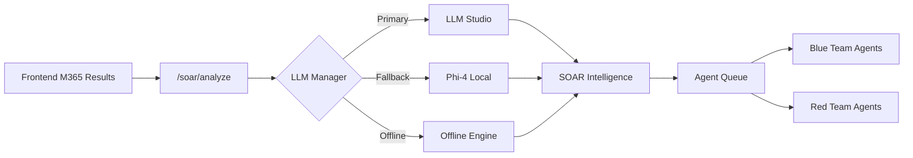

# 📋 CHANGELOG v4.3 - LLM Studio Integration

**Fecha**: 7 de Diciembre 2025  
**Versión**: 4.3.0  
**Código**: `feat: LLM Studio Integration + Dynamic Provider Manager + SOAR LLM Upgrade + AgentQueue`

---

## 🎯 Resumen Ejecutivo

Esta versión integra **LLM Studio (Jeturing AI Platform)** como proveedor principal de IA, con fallback automático a **Phi-4 Local** y modo **Offline** basado en reglas. Incluye un panel de configuración completo para gestionar modelos, proveedores y parámetros del sistema.

---

## 🆕 Nuevas Funcionalidades

### 1. 🧠 LLM Provider Manager (`api/services/llm_provider.py`)

Administrador centralizado de proveedores LLM con:

- **LLM Studio** (Producción): Conexión a Jeturing AI Platform vía API OpenAI-compatible
- **Phi-4 Local** (Fallback): Motor local para análisis sin conexión
- **Offline Engine**: Reglas estáticas para modo completamente desconectado

```python
from api.services.llm_provider import llm_manager

# Generar respuesta con fallback automático
result = await llm_manager.generate("Analiza estos hallazgos...")

# Cambiar proveedor manualmente
llm_manager.set_provider("phi4_local")

# Obtener estado del sistema
status = llm_manager.get_status()
```

### 2. 🔌 API REST LLM Settings (`api/routes/llm_settings.py`)

Nuevos endpoints para gestión:

| Endpoint | Método | Descripción |
|----------|--------|-------------|
| `/api/v41/llm/status` | GET | Estado completo del sistema LLM |
| `/api/v41/llm/provider` | POST | Cambiar proveedor activo |
| `/api/v41/llm/test` | POST | Probar generación con prompt |
| `/api/v41/llm/health` | GET | Health check de todos los proveedores |
| `/api/v41/llm/statistics` | GET | Estadísticas de uso |
| `/api/v41/llm/reset-stats` | POST | Reiniciar estadísticas |

### 3. 🤖 SOAR Intelligence Engine (`api/services/soar_intelligence.py`)

Integración profunda con LLM para:

- **Clasificación inteligente de hallazgos**
- **Generación de severidad con scoring**
- **Acciones sugeridas priorizadas**
- **Extracción automática de IOCs**
- **Categorización de amenazas**

```python
from api.services.soar_intelligence import soar_engine

# Analizar hallazgos con IA
analysis = await soar_engine.analyze_findings(findings_dict)
# Retorna: severity, summary, actions, priority, tags
```

### 4. ⚡ Agent Queue (`api/services/agent_queue.py`)

Cola de ejecución concurrente mejorada:

- **Límites por tipo de agente** (Blue: 5, Red: 3, Purple: 2)
- **Prioridades dinámicas** (critical > high > normal > low)
- **Reintentos automáticos** con backoff
- **Tracking de tareas** en tiempo real

### 5. 🎨 Panel Frontend LLM Settings (`frontend-react/src/components/Settings/LLMSettings.jsx`)

Nuevo panel de configuración con:

- Estado en tiempo real del sistema
- Selector de proveedor activo
- Estadísticas de uso por proveedor
- Consola de test de prompts
- Health check visual

**Ruta**: `/settings/llm`

---

## 📊 Arquitectura de Proveedores

```
┌─────────────────────────────────────────────────────────────┐
│                    LLM Provider Manager                      │
├─────────────────────────────────────────────────────────────┤
│                                                             │
│  ┌─────────────┐    ┌─────────────┐    ┌─────────────┐     │
│  │  LLM Studio │◄──►│ Phi-4 Local │◄──►│   Offline   │     │
│  │  (Primary)  │    │  (Fallback) │    │   (Rules)   │     │
│  └─────────────┘    └─────────────┘    └─────────────┘     │
│         │                 │                  │              │
│         └─────────────────┼──────────────────┘              │
│                           │                                 │
│                           ▼                                 │
│                  ┌─────────────────┐                        │
│                  │ SOAR Intelligence│                       │
│                  └────────┬────────┘                        │
│                           │                                 │
│                           ▼                                 │
│                   ┌──────────────┐                          │
│                   │  AgentQueue  │                          │
│                   └──────────────┘                          │
└─────────────────────────────────────────────────────────────┘
```

---

## 🔧 Configuración

### Variables de Entorno

```bash
# Proveedor LLM activo (llm_studio|phi4_local|offline)
LLM_PROVIDER=llm_studio

# URL del servidor LLM Studio (API OpenAI-compatible)
LLM_STUDIO_URL=http://100.101.115.5:2714/v1/completions

# API Key (opcional si el servidor no requiere autenticación)
LLM_STUDIO_API_KEY=
```

### Parámetros de Modelo

| Parámetro | LLM Studio | Phi-4 Local |
|-----------|------------|-------------|
| `model` | phi4 | - |
| `max_tokens` | 512 | 256 |
| `temperature` | 0.4 | 0.3 |
| `timeout` | 40s | - |

---

## 📈 Flujo de Datos



---

## 🧪 Testing

### Test de Integración LLM

```bash
# Verificar estado del sistema
curl http://localhost:8888/api/v41/llm/status

# Cambiar proveedor
curl -X POST http://localhost:8888/api/v41/llm/provider \
  -H "Content-Type: application/json" \
  -d '{"provider": "phi4_local"}'

# Test de prompt
curl -X POST http://localhost:8888/api/v41/llm/test \
  -H "Content-Type: application/json" \
  -d '{"prompt": "Classify this finding: suspicious OAuth app detected"}'
```

### Verificar Módulos

```python
cd /home/hack/mcp-kali-forensics
source venv/bin/activate
python3 -c "
from api.services.llm_provider import llm_manager
print(f'Provider: {llm_manager.active_provider}')
print(f'URL: {llm_manager.llm_studio_url}')
"
```

---

## 📁 Archivos Modificados/Creados

### Backend
- `api/services/llm_provider.py` - Manager de proveedores LLM
- `api/services/llm_local.py` - Motor Phi-4 local
- `api/services/soar_intelligence.py` - Integración SOAR + LLM
- `api/services/agent_queue.py` - Cola de agentes
- `api/routes/llm_settings.py` - API REST configuración

### Frontend
- `frontend-react/src/components/Settings/LLMSettings.jsx` - Panel de configuración

### Documentación
- `docs/CHANGELOG_v4.3_LLM_INTEGRATION.md` - Este documento

---

## ⚠️ Notas de Migración

1. **Nueva variable de entorno**: Agregar `LLM_STUDIO_URL` al `.env`
2. **Fallback automático**: Si LLM Studio no responde, automáticamente se usa Phi-4 Local
3. **Sin dependencias nuevas**: Usa `httpx` (ya instalado) para comunicación HTTP

---

## 🔒 Seguridad

- Las credenciales LLM nunca se exponen en logs
- El API key es opcional y se envía solo si está configurado
- El modo offline no hace ninguna llamada de red
- Los prompts no contienen datos sensibles del usuario

---

## 🚀 Próximos Pasos (v4.4)

- [ ] Soporte para múltiples modelos en LLM Studio
- [ ] Caché de respuestas frecuentes
- [ ] Fine-tuning de prompts por tipo de análisis
- [ ] Métricas de calidad de respuestas
- [ ] Integración con RAG para contexto de caso

---

**Autor**: Jeturing Platform  
**Aprobado por**: Jhonatan Carvajal
