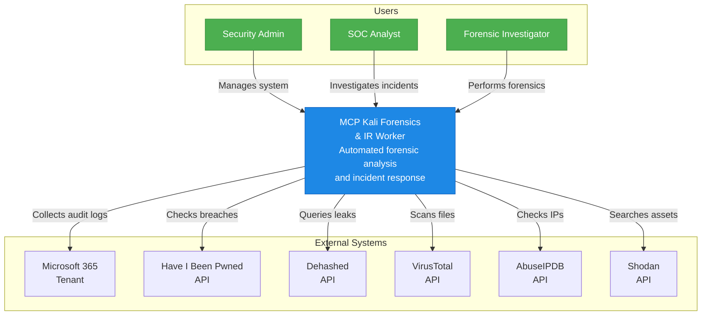
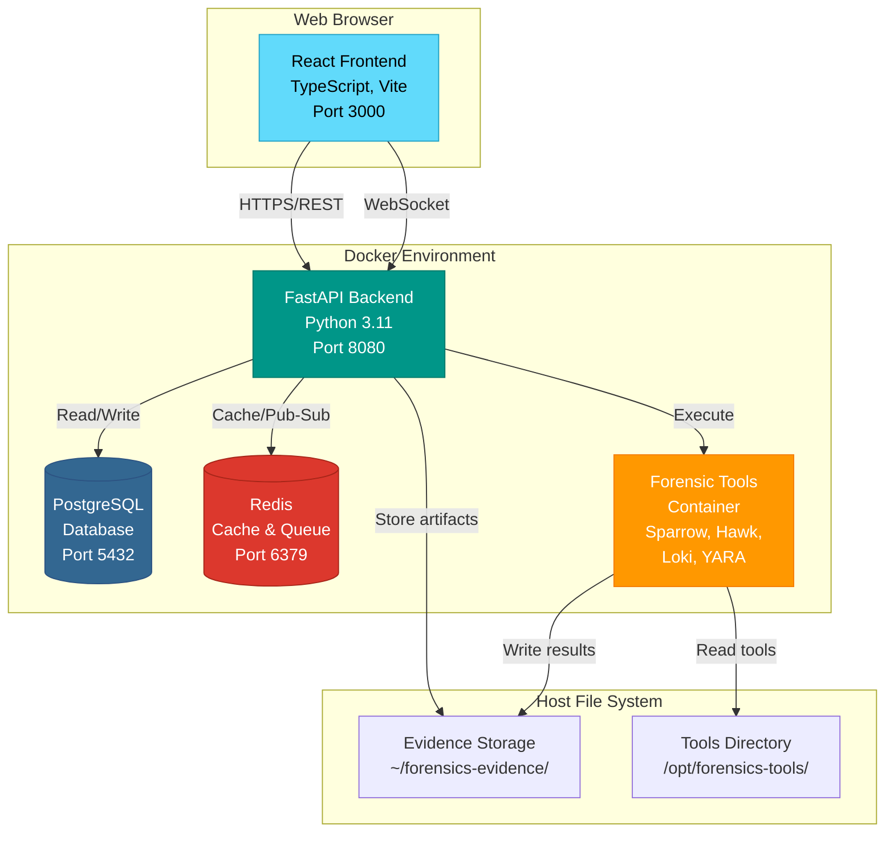
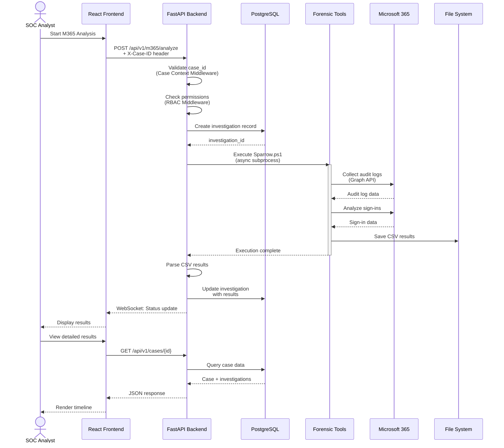
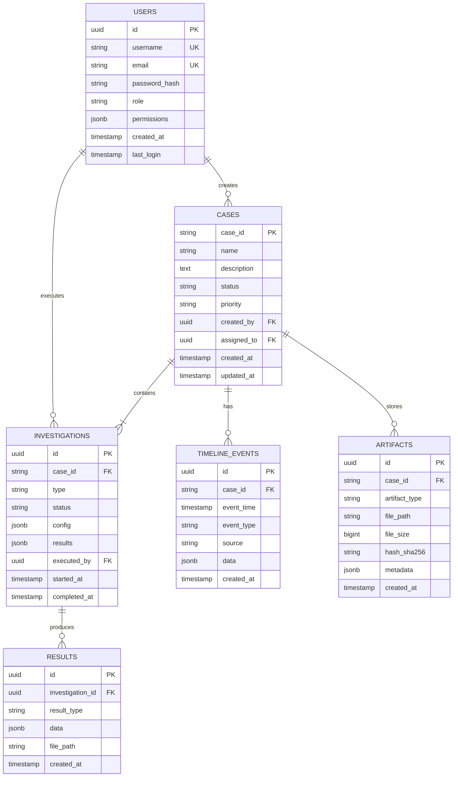
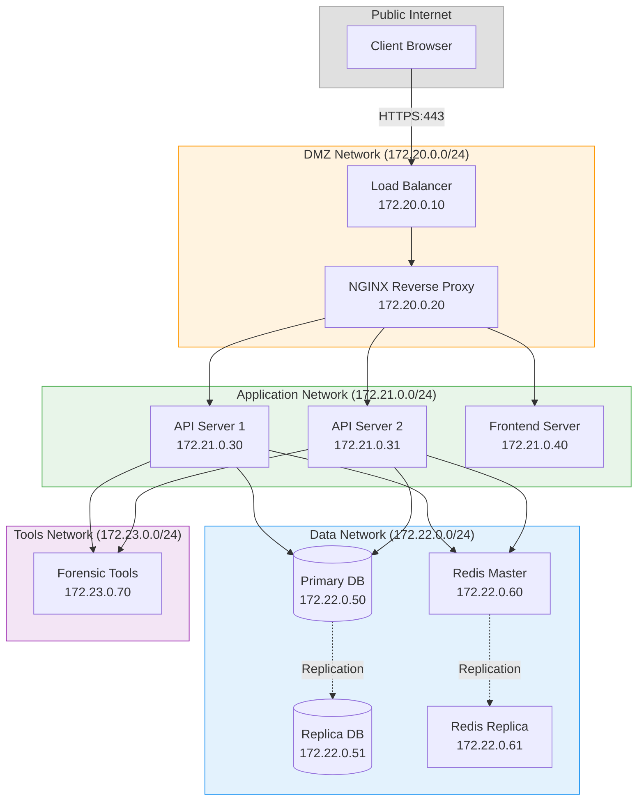

# Architecture Diagrams - MCP Kali Forensics

**Version:** v4.5.0  
**Date:** December 2024  
**Model:** C4 Architecture Model

---

## 📋 Overview

This document contains comprehensive architecture diagrams for the MCP Kali Forensics & IR Worker system, following the C4 model (Context, Container, Component, Code).

---

## 1. System Context Diagram (Level 1)

Shows how the MCP Forensics system fits into the broader environment.



---

## 2. Container Diagram (Level 2)

Shows the high-level technical building blocks of the system.



---

## 3. Component Diagram - Backend API (Level 3)

Shows the internal structure of the FastAPI backend.

```mermaid
graph TB
    subgraph API["FastAPI Application"]
        Main[main.py<br/>Entry Point<br/>CORS, Lifespan]
        
        subgraph Routes["API Routes /api/v1"]
            CasesR[Cases Router<br/>CRUD operations]
            M365R[M365 Router<br/>Sparrow, Hawk]
            CredsR[Credentials Router<br/>HIBP, Dehashed]
            EndpointR[Endpoint Router<br/>Loki, YARA]
        end
        
        subgraph Services["Business Logic"]
            CasesS[Case Service]
            M365S[M365 Service]
            CredsS[Credentials Service]
            EndpointS[Endpoint Service]
        end
        
        subgraph Middleware["Middleware Stack"]
            Auth[Authentication<br/>API Key Validation]
            RBAC[RBAC Middleware<br/>Permission Checks]
            CaseCtx[Case Context<br/>case_id Validation]
            Deprec[Deprecation<br/>Route Tracking]
        end
        
        subgraph Models["Data Models"]
            CaseM[Case Model]
            InvestM[Investigation Model]
            UserM[User Model]
        end
    end
    
    Main --> Routes
    Routes --> Services
    Services --> Models
    
    Main --> Middleware
    Middleware --> Routes
    
    style Main fill:#1e88e5,stroke:#1565c0,color:#fff
    style Routes fill:#4caf50,stroke:#388e3c,color:#fff
    style Services fill:#ff9800,stroke:#f57c00,color:#fff
    style Middleware fill:#9c27b0,stroke:#7b1fa2,color:#fff
    style Models fill:#f44336,stroke:#d32f2f,color:#fff
```



---

## 4. Component Diagram - React Frontend (Level 3)

Shows the internal structure of the React application.

```mermaid
graph TB
    subgraph Frontend["React Application"]
        App[App.tsx<br/>Root Component<br/>Router Setup]
        
        subgraph Pages["Pages"]
            Dashboard[Dashboard]
            Cases[Cases List]
            CaseDetail[Case Detail]
            Investigation[Investigation]
            Reports[Reports]
        end
        
        subgraph Components["Reusable Components"]
            CaseCard[Case Card]
            Timeline[Timeline]
            Graph[Network Graph]
            DataTable[Data Table]
            Modal[Modal Dialog]
        end
        
        subgraph State["State Management"]
            Store[Redux Store]
            CaseSlice[Case Slice]
            AuthSlice[Auth Slice]
            UISlice[UI Slice]
        end
        
        subgraph Services["API Services"]
            CaseAPI[Case API]
            M365API[M365 API]
            CredsAPI[Credentials API]
        end
        
        subgraph Hooks["Custom Hooks"]
            UseCases[useCases]
            UseAuth[useAuth]
            UseWebSocket[useWebSocket]
        end
    end
    
    App --> Pages
    Pages --> Components
    Pages --> Hooks
    Hooks --> Services
    Hooks --> State
    Components --> State
    
    style App fill:#61dafb,stroke:#21a1c4,color:#000
    style Pages fill:#4caf50,stroke:#388e3c,color:#fff
    style Components fill:#ff9800,stroke:#f57c00,color:#fff
    style State fill:#9c27b0,stroke:#7b1fa2,color:#fff
    style Services fill:#f44336,stroke:#d32f2f,color:#fff
    style Hooks fill:#00bcd4,stroke:#0097a7,color:#fff
```



---

## 5. Deployment Diagram

Shows how the system is deployed with Docker.

```mermaid
graph TB
    subgraph Host["Linux Host (Kali/Ubuntu/WSL2)"]
        subgraph Docker["Docker Compose"]
            NGINX[NGINX<br/>Reverse Proxy<br/>Port 80/443]
            
            API[mcp-forensics<br/>FastAPI Container<br/>Port 8080]
            
            Frontend[frontend-react<br/>Nginx Static Server<br/>Port 3000]
            
            DB[(PostgreSQL<br/>Container<br/>Port 5432)]
            
            Cache[(Redis<br/>Container<br/>Port 6379)]
        end
        
        subgraph HostFS["Host File System"]
            Evidence[/var/evidence/<br/>Case Artifacts]
            Tools[/opt/forensics-tools/<br/>Mounted Tools]
            Logs[/var/log/forensics/<br/>Application Logs]
        end
        
        subgraph Network["Docker Network: forensics-net"]
        end
    end
    
    User[Users] -->|HTTPS:443| NGINX
    NGINX -->|Proxy| API
    NGINX -->|Serve| Frontend
    
    Frontend -.->|API Calls| API
    API -->|Query| DB
    API -->|Cache| Cache
    API -->|Read/Write| Evidence
    API -->|Execute| Tools
    API -->|Write| Logs
    
    API -.-> Network
    DB -.-> Network
    Cache -.-> Network
    Frontend -.-> Network
    
    style Host fill:#e0e0e0,stroke:#9e9e9e
    style Docker fill:#2196f3,stroke:#1976d2
    style NGINX fill:#009688,stroke:#00796b,color:#fff
    style API fill:#4caf50,stroke:#388e3c,color:#fff
    style Frontend fill:#61dafb,stroke:#21a1c4,color:#000
    style DB fill:#336791,stroke:#2c5282,color:#fff
    style Cache fill:#dc382d,stroke:#a62518,color:#fff
```

---

## 6. Data Flow Diagram - M365 Analysis

Shows the flow of data during an M365 forensic analysis.



---

## 7. Security Architecture

Shows the security layers and controls.

```mermaid
graph TB
    subgraph Internet["Internet"]
        Attacker[Potential Attacker]
    end
    
    subgraph Perimeter["Perimeter Security"]
        Firewall[Firewall<br/>iptables]
        WAF[Web Application Firewall]
    end
    
    subgraph Application["Application Layer"]
        HTTPS[TLS/HTTPS<br/>SSL Certificates]
        
        subgraph Auth["Authentication & Authorization"]
            APIKey[API Key Validation]
            RBAC[Role-Based Access Control]
            RateLimit[Rate Limiting]
        end
        
        subgraph Validation["Input Validation"]
            Sanitize[Input Sanitization]
            CSRF[CSRF Protection]
            CaseCtx[Case Context Validation]
        end
        
        subgraph Audit["Audit & Monitoring"]
            Logging[Audit Logging]
            Alerts[Security Alerts]
            Monitoring[Real-time Monitoring]
        end
    end
    
    subgraph Data["Data Layer"]
        Encryption[Data Encryption at Rest]
        Backup[Encrypted Backups]
        Access[Least Privilege Access]
    end
    
    subgraph Forensics["Forensic Tools"]
        Sandbox[Sandboxed Execution]
        ReadOnly[Read-only Tool Access]
        Isolation[Process Isolation]
    end
    
    Attacker -->|Blocked| Firewall
    Firewall --> WAF
    WAF --> HTTPS
    HTTPS --> Auth
    Auth --> Validation
    Validation --> Audit
    Audit --> Data
    Data --> Forensics
    
    style Attacker fill:#f44336,stroke:#d32f2f,color:#fff
    style Firewall fill:#ff9800,stroke:#f57c00,color:#fff
    style Auth fill:#4caf50,stroke:#388e3c,color:#fff
    style Validation fill:#2196f3,stroke:#1976d2,color:#fff
    style Audit fill:#9c27b0,stroke:#7b1fa2,color:#fff
    style Data fill:#009688,stroke:#00796b,color:#fff
    style Forensics fill:#607d8b,stroke:#455a64,color:#fff
```



---

## 8. Database Schema (Entity Relationship)

Shows the main database entities and relationships.



---

## 9. Network Topology

Shows the network architecture.



---

## 10. CI/CD Pipeline

Shows the automated deployment pipeline.

```mermaid
graph LR
    subgraph Development["Development"]
        Dev[Developer]
        Git[Git Push]
    end
    
    subgraph GitHub["GitHub"]
        PR[Pull Request]
        Main[Main Branch]
    end
    
    subgraph CI["Continuous Integration"]
        Lint[Linting<br/>Ruff, ESLint]
        Test[Testing<br/>pytest, vitest]
        Build[Build<br/>Docker Images]
        Security[Security Scan<br/>Trivy, Safety]
    end
    
    subgraph Quality["Quality Gates"]
        Coverage[Coverage > 60%]
        NoVuln[No Critical Vulns]
        Approval[Manual Approval]
    end
    
    subgraph CD["Continuous Deployment"]
        Staging[Deploy to Staging]
        StagingTest[Integration Tests]
        Production[Deploy to Production]
    end
    
    Dev --> Git
    Git --> PR
    PR --> Lint
    Lint --> Test
    Test --> Build
    Build --> Security
    Security --> Coverage
    Coverage --> NoVuln
    NoVuln --> Approval
    Approval --> Staging
    Staging --> StagingTest
    StagingTest --> Production
    
    PR -.->|Merge| Main
    Main --> Production
    
    style Development fill:#4caf50,stroke:#388e3c,color:#fff
    style GitHub fill:#24292e,stroke:#000,color:#fff
    style CI fill:#2196f3,stroke:#1976d2,color:#fff
    style Quality fill:#ff9800,stroke:#f57c00,color:#fff
    style CD fill:#9c27b0,stroke:#7b1fa2,color:#fff
```



---

## 📖 Diagram Rendering

These diagrams use Mermaid syntax and can be rendered in:

- **GitHub**: Automatically rendered in markdown
- **VS Code**: Install "Markdown Preview Mermaid Support" extension
- **Documentation Sites**: Mkdocs, Docusaurus, GitBook
- **Online**: [Mermaid Live Editor](https://mermaid.live/)

---

**Last Updated:** December 16, 2024  
**Version:** 1.0  
**Format:** Mermaid + C4 Model
